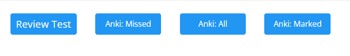
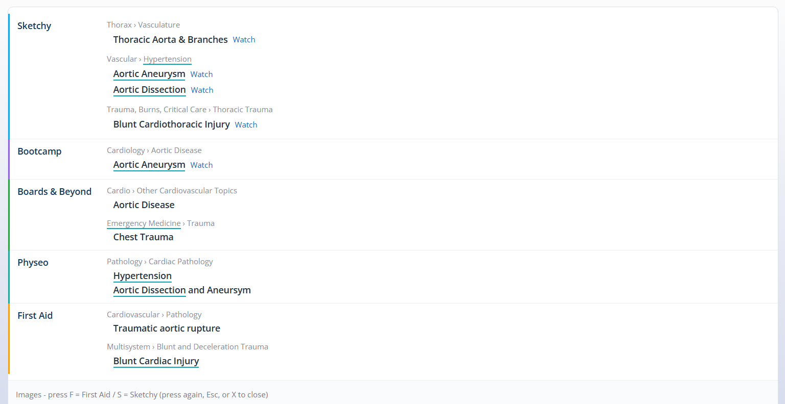
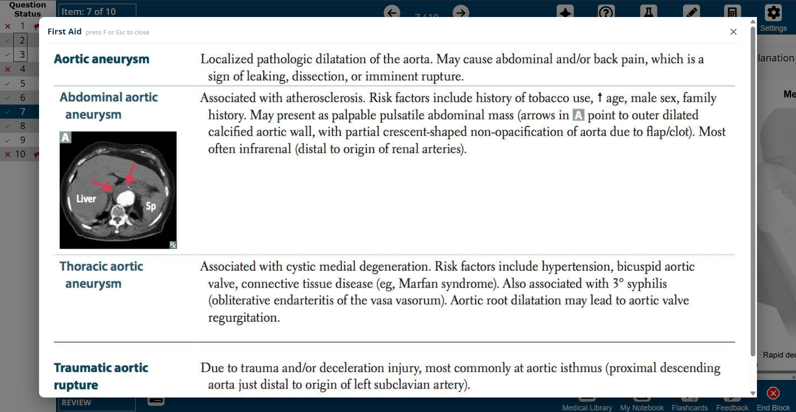
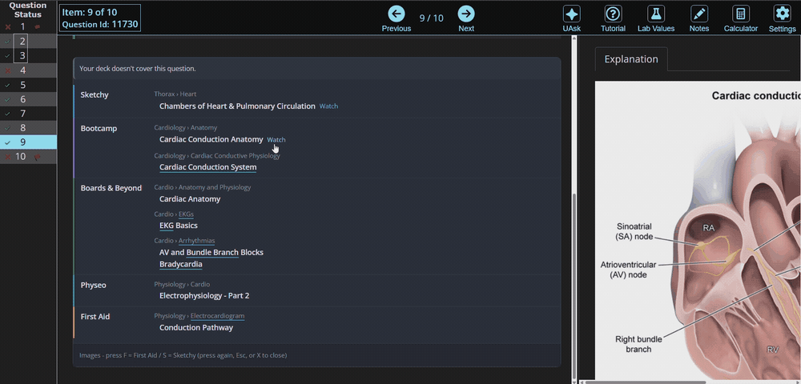
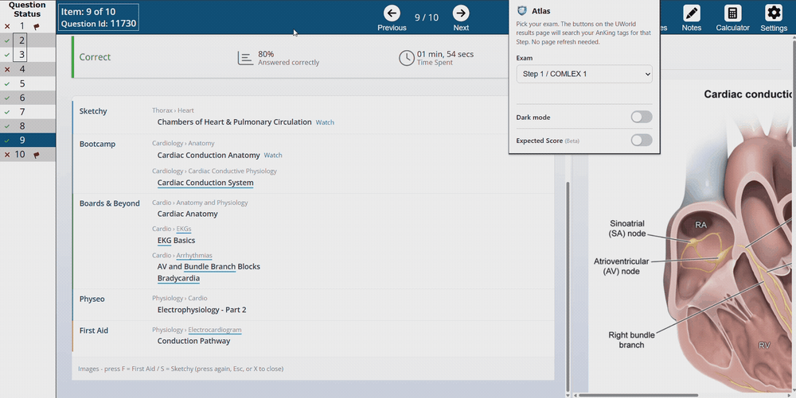
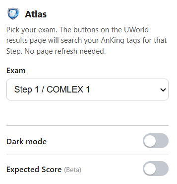
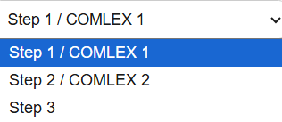

# Atlas

An Anki add-on + browser extension that connects your **UWorld** question
results to your **AnKing** Anki deck. On the UWorld results page Atlas adds
buttons that run a live tag search and open the matching AnKing cards in Anki,
and it shows you which third-party resources (B&B, Pathoma, Sketchy, etc.) cover
each topic — all without leaving the page.

  

Atlas has two parts that talk to each other over `127.0.0.1:8765`:

| Part | Folder | What it is |
|------|--------|------------|
| **Atlas Bridge** | [`anki-addon/`](anki-addon) | A tiny local Anki add-on. Exposes a few read-only actions to the extension. |
| **Atlas** | [`chrome-extension/`](chrome-extension) | The browser extension (Chrome / Brave / Edge) that adds the buttons to UWorld. |

Both are required — the extension is the UI, the add-on is what lets it reach
your Anki collection.

---

## What it does

- **Open matching AnKing cards** straight from the UWorld results page via a live tag search — Missed, All, or Marked.
- **See every resource that covers the topic.** Atlas pulls the third-party tags off your cards and lays them out by source (Sketchy, Boards & Beyond, Bootcamp, Physeo, First Aid…), with one-click links.
- **View resource images inline** — First Aid and Sketchy images open right over the question, no tab switching.
- **Picks the right deck automatically** based on your exam: Step 1 / COMLEX 1, Step 2 / COMLEX 2, or Step 3.
- **Optional dark mode** and an **Expected Score (Beta)** estimate from your card maturity.
- **No page refresh needed** — change your exam in the popup and it applies on your next click.

### The resources panel

For each question, Atlas lists what covers the topic, grouped by resource:

  

### Resource images, inline

Press **F** for First Aid or **S** for Sketchy to overlay the relevant images on the question:

  

  

### Jump to videos

The **Watch** links open the matching video for that subtopic:

  

### Dark mode

  

---

## Installation

You need to install **both** pieces. Order doesn't matter, but Anki must be
running (with the add-on) for the extension to work.

### 1. Anki add-on (Atlas Bridge)

1. Find your Anki add-ons folder: in Anki, **Tools → Add-ons → View Files**.
2. Create a new folder inside it named `atlas_bridge`.
3. Copy everything from this repo's [`anki-addon/`](anki-addon) folder into it
   (`__init__.py`, `config.json`, `config.md`, `manifest.json`).
4. Restart Anki.

The bridge starts automatically and listens on `127.0.0.1:8765`.

> **Note on AnkiConnect:** Atlas Bridge uses the same port (`8765`) as
> AnkiConnect, so only one can run at a time. If you already have AnkiConnect,
> either disable it or change the port in both the add-on config and the
> extension. The bridge only exposes a small set of **read-only** actions
> (`version`, `findNotes`, `notesInfo`, `retrieveMediaFile`, `guiBrowse`,
> `getTags`, plus the maturity/cards helpers), and it only accepts requests
> from the Atlas extension and localhost.

### 2. Browser extension (Atlas)

1. Go to `chrome://extensions` (or `brave://extensions`).
2. Turn on **Developer mode** (top-right).
3. Click **Load unpacked** and select this repo's
   [`chrome-extension/`](chrome-extension) folder.
4. Pin Atlas to your toolbar if you like.

The extension's ID is fixed (via the `key` in its manifest), which is how the
add-on knows to trust it without any setup.

---

## Usage

1. Open Anki (so the bridge is running).
2. Set your exam in the Atlas popup, then use the buttons on the UWorld results page.

  
  &nbsp;&nbsp;
  

Optional toggles in the popup:

- **Dark mode** — dark styling for the popup.
- **Expected Score (Beta)** — an estimate derived from how mature your linked cards are.

---

## Configuration

The add-on's settings live in `config.json` (editable in Anki via
**Tools → Add-ons → Atlas Bridge → Config**):

- **`port`** — local port the bridge listens on. Default `8765`. Only change it
  if you also run AnkiConnect; if you do, point the extension at the new port
  too.
- **`extraOrigins`** — extra extension/website origins allowed to talk to the
  bridge. Atlas's own origin is already allowed, so normally leave this empty.

Restart Anki after changing these.

---

## How it works

The extension never talks to Anki from the UWorld page directly (UWorld blocks
in-page requests). Instead its **background service worker** makes the calls to
`127.0.0.1:8765`, and the **Atlas Bridge** add-on answers them on Anki's main
thread (the collection isn't thread-safe, so every read is marshalled there).
The bridge mirrors the slice of the AnkiConnect API that Atlas needs, so it
works as a drop-in.

---

*For studying with UWorld + the AnKing deck. Not affiliated with UWorld, AnKing, or Anki.*
