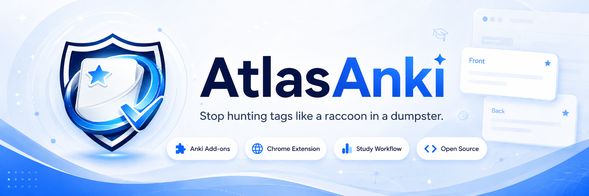
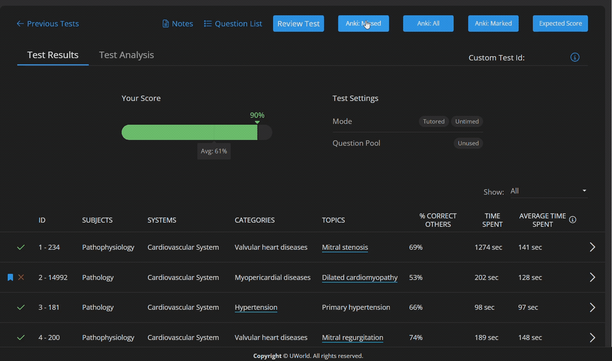
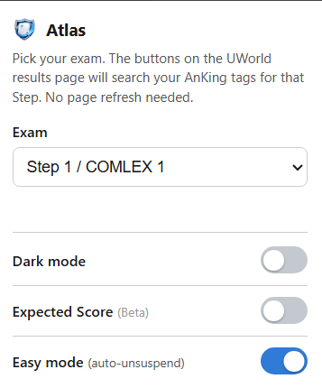
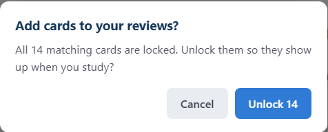
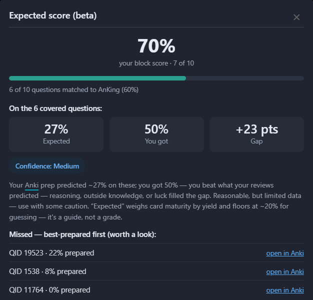

  

# Atlas

### Stop hunting tags like a raccoon in a dumpster.

**Atlas connects your UWorld results to AnKing cards, resource tags, videos, and images — directly from your browser.**

  
  
  

  

**For students who live inside UWorld, Anki, and 47 browser tabs.**

---

## What is Atlas?

**Atlas** is a browser extension + Anki add-on that connects your **UWorld results** to your **AnKing Anki deck**.

When you review a UWorld block, Atlas adds buttons that help you open matching AnKing cards, see which resources cover the topic, view images, jump to videos, and optionally unsuspend matched cards with Easy Mode.

Basically:

**UWorld tells you what you missed. Atlas helps you find what to study next.**

---

## Quick install

Atlas has two parts.
You need **both**.

| Part                         | What it does                                          | Install                                                                                                      |
| ---------------------------- | ----------------------------------------------------- | ------------------------------------------------------------------------------------------------------------ |
| **Atlas Browser Extension**  | Adds Atlas buttons and panels to UWorld               | [Chrome Web Store](https://chromewebstore.google.com/detail/atlas/nldpifnmnejhebgajmkfdijgianbahkj?hl=en-US) |
| **Atlas Bridge Anki Add-on** | Lets the extension talk to your local Anki collection | [AnkiWeb](https://ankiweb.net/shared/info/147357374)                                                         |

---

## Installation guide

### 1. Install the browser extension

Install the Atlas browser extension from the [Chrome Web Store](https://chromewebstore.google.com/detail/atlas/nldpifnmnejhebgajmkfdijgianbahkj?hl=en-US).
After installing it, pin Atlas to your browser toolbar for quick access.
Atlas works on Chrome and other Chromium-based browsers such as Brave and Edge.

---

### 2. Install the Anki add-on

Install Atlas Bridge from [AnkiWeb](https://ankiweb.net/shared/info/147357374).
Then restart Anki.
Atlas Bridge starts automatically when Anki opens.

---

### 3. Keep Anki open

Atlas needs Anki to be open while you use UWorld.
The browser extension is the interface.
The Anki add-on is the bridge.
If Anki is closed, Atlas cannot open cards, check tags, show card data, or use Easy Mode.

---

### 4. Review a UWorld block

1. Open Anki.
2. Open UWorld in your browser.
3. Finish or review a UWorld block.
4. Go to the UWorld results page.
5. Use the Atlas buttons to open matching AnKing cards.

  

---

## What Atlas helps you do

| Feature                           | What it does                                                      |
| --------------------------------- | ----------------------------------------------------------------- |
| **Missed / Marked / All buttons** | Opens matching AnKing cards from your UWorld results.             |
| **Resource panel**                | Shows which third-party resources cover the same topic.           |
| **Image overlay**                 | Opens First Aid and Sketchy images directly on the question page. |
| **Watch links**                   | Jumps to matching resource videos when available.                 |
| **Exam selector**                 | Supports Step 1 / COMLEX 1, Step 2 / COMLEX 2, and Step 3.        |
| **Easy Mode**                     | Auto-unsuspends matched cards after confirmation.                 |
| **High Yield Only**               | Focuses Atlas buttons on high-yield cards when available.         |
| **Expected Score Beta**           | Estimates performance using linked card maturity.                 |
| **Dark mode**                     | Makes the popup easier on the eyes.                               |

---

## Preview

### UWorld buttons

  

Atlas adds buttons directly to your UWorld results page so you can open matching cards from **Missed**, **Marked**, or **All** questions.

---

### Resource panel

  

Atlas groups related AnKing resource tags by source, so you can quickly see what covers the topic.

---

### Image overlay

  

Press **F** for First Aid images or **S** for Sketchy images without switching tabs.

---

### Watch links

  

Open matching resource videos directly from the Atlas panel when links are available.

---

### Dark mode

  

Because your eyes deserve mercy.

---

## Easy Mode

Easy Mode is for when you do **not** want to manually open the Anki Browser, select cards, right-click, and unsuspend.

With Easy Mode **off**, Atlas opens the matching cards in the Anki Browser.

With Easy Mode **on**, Atlas checks the matched cards and asks before unsuspending them into your review queue.
It always shows the card count first, so a stray click cannot quietly dump cards into your reviews.

  

  

  

Easy Mode is **off by default**.

---

## Expected Score (Beta)

After a block, Atlas estimates how prepared you actually were on the questions your AnKing cards cover — your expected vs. actual score, the gap, a confidence level, and a list of your best-prepared misses you can open straight in Anki.
It weighs card maturity by yield and is meant as a guide, not a grade.

  

---

## Basic usage

Open the Atlas popup from your browser toolbar.

Choose your exam mode:

* **Step 1 / COMLEX 1**
* **Step 2 / COMLEX 2**
* **Step 3**

  

Then review a UWorld block and use the Atlas buttons on the results page.

---

## How Atlas works

Atlas has two parts:

| Part                         | Purpose                                                         |
| ---------------------------- | --------------------------------------------------------------- |
| **Atlas Browser Extension**  | Adds Atlas buttons and panels to UWorld.                        |
| **Atlas Bridge Anki Add-on** | Lets the extension communicate with your local Anki collection. |

Both are required.
The extension is what you click.
The Anki add-on is what lets those clicks talk to your Anki deck.

---

## Troubleshooting

### Atlas says it is not connected

Make sure:

1. Anki is open.
2. Atlas Bridge is installed in Anki.
3. You restarted Anki after installing the add-on.
4. The Atlas browser extension is installed.
5. You are on a UWorld results/review page.

Then open the Atlas popup again.

---

### The buttons appear, but cards do not open

Check that:

* Anki is open.
* Your AnKing deck is installed.
* Atlas Bridge is installed and enabled in Anki.
* You restarted Anki after installing Atlas Bridge.
* You are reviewing a UWorld block with results available.

---

### Easy Mode does not unsuspend anything

Check that:

* Easy Mode is turned on in the popup.
* The matched cards are actually suspended.
* Anki is open.
* Atlas Bridge is installed and running.
* You confirmed the unsuspend dialog.

If no suspended cards are found, Atlas will not add anything to your review queue.

---

### I already use AnkiConnect

Atlas Bridge listens on its own local port (8766), deliberately different from AnkiConnect's 8765, so the two can run at the same time.
Most users do not need to change any settings.

---

## Privacy

Atlas is designed to work locally between your browser and Anki.
It does not need your AnkiWeb login.
It does not upload your Anki collection to a server.
Easy Mode only unsuspends cards after showing a confirmation first.

Read the full privacy policy here:
[PRIVACY.md](PRIVACY.md)

---

## Support Atlas

Atlas is free.
Support helps with bug fixes, updates, UWorld/Anki compatibility, and new features.

  

---

## Links

| Link             | URL                                                                                                       |
| ---------------- | --------------------------------------------------------------------------------------------------------- |
| Chrome Web Store | [Install Atlas](https://chromewebstore.google.com/detail/atlas/nldpifnmnejhebgajmkfdijgianbahkj?hl=en-US) |
| AnkiWeb Add-on   | [Install Atlas Bridge](https://ankiweb.net/shared/info/147357374)                                         |
| Ko-fi            | [Support Atlas](https://ko-fi.com/atlasanki)                                                              |
| Privacy Policy   | [PRIVACY.md](PRIVACY.md)                                                                                  |

---

## Changelog

### v2.0

* Redesigned popup with grouped **Study actions** and **Extras**, plus a live "Ready" connection status.
* Added **High Yield Only** to focus the buttons on high-yield cards.
* Richer **Expected Score (Beta)**: expected vs. actual, the gap, a confidence level, and a best-prepared-misses list.
* Atlas Bridge moved to port **8766** so it runs alongside AnkiConnect.

### v1.7

* Added **Easy Mode**.
* Added one-click auto-unsuspend after confirmation.
* Shows card count before unlocking cards.
* Keeps normal open-in-Anki behavior when Easy Mode is off.

### v1.6

* Added grouped resource panel.
* Added First Aid and Sketchy image overlays.
* Added video watch links.
* Added dark mode.
* Added Expected Score Beta.

---

## Disclaimer

Atlas is an independent study tool.
It is not affiliated with UWorld, AnKing, Anki, Sketchy, Boards & Beyond, Bootcamp, Pathoma, Physeo, First Aid, or any other third-party resource.
Use it as a study helper, not as an excuse to do 900 cards at 2 a.m.
